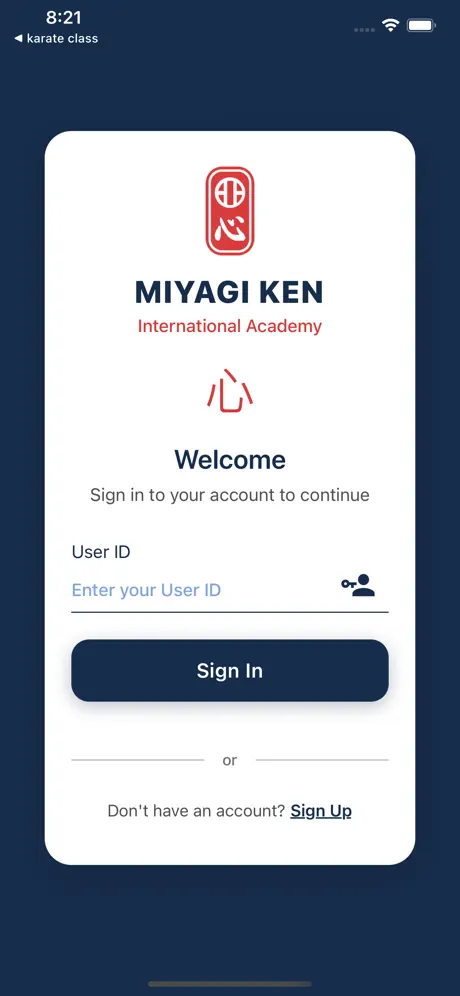
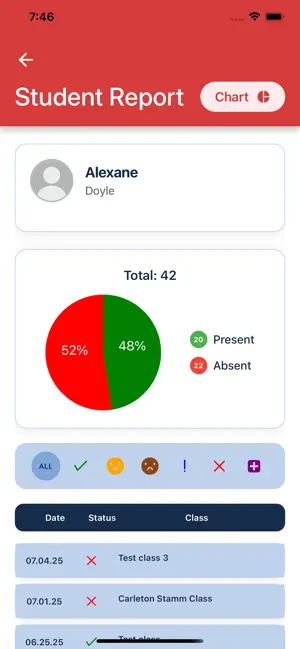

# Class Management App

A production-ready React Native application used by Miyagi Ken International Academy to manage karate classes, attendance, and student recovery credits across the United States. The mobile app is built with Expo and communicates with the companion [class-management-api](https://github.com/USERNAME/class-management-api) service to provide end-to-end operations for administrators, teachers, and students.






## Table of contents

1. [Product overview](#product-overview)
2. [User capabilities](#user-capabilities)
3. [Architecture overview](#architecture-overview)
4. [Key directories](#key-directories)
5. [API integration](#api-integration)
6. [Local development](#local-development)
7. [Build & release](#build--release)
8. [Quality & tooling](#quality--tooling)
9. [Next ideas](#next-ideas)

## Product overview

The Class Management App delivers a unified workspace for scheduling karate classes, tracking attendance, managing student credits, and exporting analytics. The home experience provides a branded login that validates user IDs before routing users into role-based workspaces backed by persisted Redux state, ensuring frictionless sessions in production deployments.【F:app/(home)/index.tsx†L1-L6】【F:screens/platform-access/Login/Login.tsx†L1-L148】【F:app/_layout.tsx†L1-L45】

## User capabilities

| Persona | Core actions |
| --- | --- |
| **Students** | Browse assigned classes, reserve recovery sessions when absent, view personal performance charts, and monitor recovery credit balances that sync with the API.【F:app/(student)/index.tsx†L1-L8】【F:screens/control-panel/ClassesScreen/index.tsx†L39-L182】 |
| **Teachers** | Open the attendance workspace, review the day’s roster, and submit real-time attendance updates through calendar-driven sessions that summarise presence vs. absence counts.【F:app/(teacher)/index.tsx†L1-L5】【F:screens/control-panel/AttendanceScreen/index.tsx†L1-L200】 |
| **Administrators** | Operate through a five-tab control panel to manage classes, generate reports, capture attendance, administer student/teacher records, and adjust configuration settings.【F:app/(admin)/_layout.tsx†L1-L14】【F:screens/control-panel/ClassesScreen/index.tsx†L39-L200】【F:screens/control-panel/StudentsScreen/index.tsx†L1-L200】【F:screens/control-panel/ReportScreen/ReportScreen.tsx†L1-L200】 |

### Analytics & reporting

Administrators and students can open dedicated report modals to inspect attendance trends, pie charts, and export CSV summaries for daily, per-class, or student-level metrics using the legacy Expo FileSystem for compatibility with SDK 54.【F:screens/control-panel/ReportScreen/ReportScreen.tsx†L1-L200】【F:shared/export-helpers.ts†L1-L200】

## Architecture overview

The app follows a modular architecture that separates navigation, state management, domain logic, and presentation layers.

### Navigation & routing

* **Expo Router segments** route users to home, admin, student, or teacher stacks depending on decoded JWT claims stored in Redux. The root layout hydrates persisted sessions before rendering protected stacks.【F:app/_layout.tsx†L1-L45】
* **Tab-driven workspaces** are declared per role (e.g., five admin tabs) and rendered through a reusable `TabLayout` wrapper that unifies icons, styling, and safe-area padding.【F:app/(admin)/_layout.tsx†L1-L14】【F:components/TabLayout/TabLayout.tsx†L1-L36】

### State management

* **Redux store** aggregates reducers for authentication, classes, attendance, reports, holidays, and students, with thunk middleware for async flows and redux-persist for session restoration.【F:redux/store.ts†L1-L43】
* **Domain-specific actions** call the API with authenticated requests, decode JWT payloads, and normalise CRUD flows for classes, users, attendance, and recovery credits.【F:redux/actions/userActions.ts†L1-L200】【F:screens/control-panel/ClassesScreen/index.tsx†L39-L200】

### Data access layer

* A shared Axios instance injects API base URLs and keys, adds request interceptors, and standardises timeout messaging for slow responses.【F:config/axios.ts†L1-L25】
* Environment variables (`EXPO_PUBLIC_*`) encapsulate the backend URL and API key; copy `env.template` when bootstrapping local environments.【F:env.template†L1-L2】

### Presentation layer

* **Styled-components theme** provides an extensive palette that powers consistent branding across cards, modals, and typography.【F:theme/colors.ts†L1-L105】
* **Reusable UI primitives** (headers, inputs, loaders, modals, badges) are shared between role-specific screens to keep UX consistent while supporting domain-specific interactions like class filtering or student badges.【F:screens/control-panel/ClassesScreen/index.tsx†L39-L200】【F:screens/control-panel/StudentsScreen/index.tsx†L1-L200】
* **Reporting modals** overlay charts, filters, and export triggers for each metric category while reusing a common `ReportCard` UX component.【F:screens/control-panel/ReportScreen/ReportScreen.tsx†L1-L200】

### Device capabilities

* CSV exports leverage Expo’s legacy FileSystem and Sharing APIs to generate shareable files on-device, handling iOS-specific dialogs and validation messaging.【F:shared/export-helpers.ts†L1-L200】
* Calendar attendance views rely on `react-native-calendars` to visualise marked dates, while `react-native-pie-chart` provides quick visual feedback within student reports (see `ReportScreen` components).

## Key directories

| Path | Purpose |
| --- | --- |
| `app/` | Expo Router entry points grouped by user role (`(home)`, `(admin)`, `(teacher)`, `(student)`).【F:app/_layout.tsx†L1-L45】【F:app/(admin)/_layout.tsx†L1-L14】 |
| `screens/control-panel/` | Role-specific feature screens for classes, attendance, reports, students, and settings, each with co-located components/helpers/styles.【F:screens/control-panel/ClassesScreen/index.tsx†L39-L200】【F:screens/control-panel/AttendanceScreen/index.tsx†L1-L200】【F:screens/control-panel/StudentsScreen/index.tsx†L1-L200】 |
| `screens/platform-access/` | Authentication and onboarding flows (login, info).【F:screens/platform-access/Login/Login.tsx†L1-L148】 |
| `redux/` | Redux store configuration, reducers, async actions, and constants for all domains.【F:redux/store.ts†L1-L43】【F:redux/actions/userActions.ts†L1-L200】 |
| `config/` | Cross-cutting configuration such as the Axios client with interceptors.【F:config/axios.ts†L1-L25】 |
| `shared/` | Utilities, helpers, presentation primitives, and CSV export helpers shared across screens.【F:shared/export-helpers.ts†L1-L200】 |
| `theme/` | Global theme tokens and styled-system primitives for consistent styling.【F:theme/colors.ts†L1-L105】 |

## API integration

The mobile client exchanges data with the `class-management-api` backend via REST endpoints secured with JWTs and an API key header. Login requests return signed tokens that populate Redux state and determine route segmentation; subsequent CRUD operations attach bearer tokens for authorization and persist updates for classes, attendance, students, and recovery credits.【F:redux/actions/userActions.ts†L11-L200】【F:config/axios.ts†L1-L25】【F:app/_layout.tsx†L12-L23】

## Local development

1. **Install dependencies** with your preferred package manager (npm, pnpm, yarn, or bun) using the provided `package.json` and `bun.lock` files. Expo SDK 54 requires Node 18+.
2. **Configure environment variables** by copying `env.template` to `.env` (or using `app.config.ts`) and pointing `EXPO_PUBLIC_API_URL` to a running instance of `class-management-api`.【F:env.template†L1-L2】
3. **Start the Expo dev server**:
   ```bash
   npm install
   npm run start
   ```
   Available scripts cover platform-specific builds and linting (`npm run ios`, `npm run android`, `npm run lint`).【F:package.json†L5-L60】
4. **Run the backend** (`class-management-api`) locally or configure the production endpoint to authenticate against existing data.
5. **Access the app** through Expo Go or a simulator; role-based navigation will redirect based on your login credentials.【F:app/_layout.tsx†L12-L23】

## Build & release

The project ships through Expo Application Services (EAS) with presets for development, preview, and production store builds. Versioning, bundle identifiers, and release channels are tracked in `app.json`, while `eas.json` defines distribution targets and submission credentials for the App Store and Google Play.【F:app.json†L2-L45】【F:eas.json†L1-L33】

## Quality & tooling

* **TypeScript-first codebase** aligned with `@tsconfig/react-native` for strong typing across actions, reducers, and components.【F:package.json†L44-L59】
* **ESLint + Prettier** enforce consistent formatting through the `lint` npm script and Expo config presets.【F:package.json†L5-L59】
* **Automated UX safeguards** like login validation, class filtering, and attendance recalculations reduce runtime errors and keep UI feedback immediate.【F:screens/platform-access/Login/Login.tsx†L31-L126】【F:screens/control-panel/ClassesScreen/index.tsx†L55-L200】【F:screens/control-panel/AttendanceScreen/index.tsx†L25-L200】

## Next ideas

* Expand automated testing (unit + E2E) to cover navigation flows and async Redux logic.
* Introduce offline caching strategies for attendance capture in low-connectivity dojos.
* Extend report exports with PDF summaries or scheduled email delivery using the backend queue.

---

_For backend implementation details, review the sister repository `class-management-api`. Recruiters and collaborators can reach out to discuss scaling strategies, design systems, or integration opportunities._
