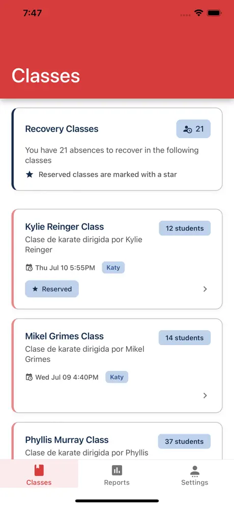
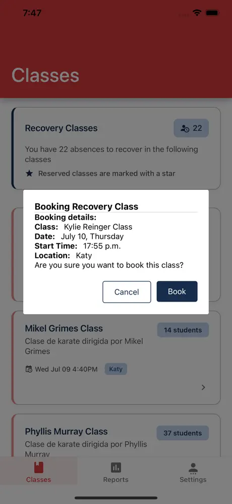

# Class Management App (React Native)


A production-ready iOS application built with Expo/React Native for managing karate academy operations across the United States market. The mobile client integrates with the companion `class-management-api` service (located in the companion repo folder) to orchestrate class schedules, attendance, recovery credits, and actionable reports for administrators, teachers, and students.

## Table of contents
- [Product overview](#product-overview)
- [User-facing features](#user-facing-features)
- [Technical architecture](#technical-architecture)
- [Project structure](#project-structure)
- [Data & state management](#data--state-management)
- [API integration](#api-integration)
- [UI & experience design](#ui--experience-design)
- [Tooling & quality](#tooling--quality)
- [Getting started](#getting-started)
- [Environment variables](#environment-variables)
- [Build & release](#build--release)
- [Future improvements](#future-improvements)

## Product overview
The Class Management App digitises the day-to-day workflows of the Miyagi Ken International Academy. Deployed to the iOS App Store for the US market, it enables the academy to:

- Centralise class schedules, locations, instructors, and capacity.
- Track attendance in real time and manage recovery credits for student absences.
- Provide transparent reporting to both academy leadership and students.
- Empower administrators to manage users, calendars, and special events (holidays, makeup sessions) from a single interface.



## User-facing features
The experience is tailored around three primary personas:

### Students
- Personalised class list with location, instructor, and upcoming schedule info.
- Recovery class booking for missed sessions, deducting from available recovery credits.
- Visual attendance summaries and downloadable student-level reports.
- Settings area to review account metadata and manage logout/persistence.

### Teachers
- Streamlined attendance-taking workflows filtered by assigned classes and session dates.
- Quick status toggles for present/absent plus recovery class hand-offs.
- Access to historical attendance records and daily roll-ups for auditing.

### Administrators
- Full CRUD for classes, students, and teachers, including onboarding trial students and scheduling deletions.
- Attendance oversight with the ability to add/remove students from sessions and reset the system when needed.
- Rich reporting: daily academy summaries, class-level performance, and student attendance analytics with export helpers.
- Holiday management and recovery credit adjustments to handle exceptional scenarios.




## Technical architecture
- **Framework**: [Expo](https://expo.dev/) SDK 54 with Expo Router for file-system based navigation (`app/` directory) and StatusBar handling. [`app/_layout.tsx`](app/_layout.tsx) wires Redux, persistence, and navigation stack transitions.
- **Language**: TypeScript across the entire codebase for strict typing and editor tooling (`tsconfig.json`).
- **State management**: Redux with Redux Thunk for async flows, enhanced by Redux Persist to retain authenticated sessions across restarts (`redux/store.ts`).
- **Networking**: Axios client with request/response interceptors (`config/axios.ts`) handles API key injection, base URL configuration, and timeout messaging.
- **Styling**: Styled Components for themed UI primitives, centralised palette in [`theme/colors.ts`](theme/colors.ts) with brand-consistent variants.
- **Utilities**: Shared helper modules for attendance calculations, export/report formatting, validators, and string formatting (`shared/`).
- **Persistence**: AsyncStorage backend to cache auth tokens and user roles, enabling offline resume of sessions.
- **Routing**: Modular tab layouts per role (Admin/Student/Teacher) using a custom `TabLayout` component (`components/TabLayout/TabLayout.tsx`).

## Project structure
```
app/                # Expo Router entry points segmented by role (home, admin, student, teacher)
components/         # Reusable UI pieces (modals, headers, forms, loaders)
config/             # Axios configuration and API client setup
redux/              # Actions, reducers, store configuration, constants
screens/            # Feature-complete screens and subcomponents (control panel, auth, reports)
shared/             # Cross-cutting helpers (formatters, validators, icons, export utilities)
theme/              # Colour tokens and styled-component wrappers
assets/             # Branding assets and static images
```

## Data & state management
The data flow follows a predictable Redux pattern:
1. **Actions** dispatch async thunks (e.g. `redux/actions/karateClassActions.ts`) that call the API and emit `REQUEST/SUCCESS/FAIL` lifecycles.
2. **Reducers** (see `redux/reducers/`) keep feature-specific slices—classes, attendance, recovery credits, reports—while a persisted `userLogin` slice stores JWT-derived session metadata.
3. **Selectors/hooks**: Typed hooks (`useAppSelector`, `useAppDispatch`) centralise store access, while `useFocusEffect` ensures screens refresh whenever users navigate back to them.
4. **Side-effects**: Post-success reducers update UI state in-place, ensuring modals close, lists refresh, and credits recalculate without extra API calls (`screens/control-panel/ClassesScreen/index.tsx`).

## API integration
The mobile app communicates exclusively with the `class-management-api` service:
- Base URL and API key are injected at runtime via Expo public environment variables (`EXPO_PUBLIC_API_URL`, `EXPO_PUBLIC_API_KEY`).
- Each authenticated request attaches the bearer token issued by the API (`redux/actions/userActions.ts`), and the client proactively surfaces timeout messaging to the user.
- Core endpoints cover auth, users, classes, attendance, reports, recovery classes, and holiday calendars. Redux constants mirror these domains for predictable state resets.
- Export utilities generate CSV-ready datasets for admin reporting (see `shared/export-helpers.ts`).

## UI & experience design
- **Design system**: Colour scales and semantic tokens in `theme/colors.ts` are consumed by styled components to maintain accessibility and brand fidelity.
- **Forms & validation**: Custom form inputs (`components/CustomInputForm`) with iconography and validation helpers (`shared/validators/input-validators.ts`) guide user input.
- **Modals & feedback**: Modal components for confirmation, selection, and booking ensure critical flows (recovery booking, deletions) are explicit.
- **Charts & calendars**: `react-native-pie-chart` powers attendance visuals, while `react-native-calendars` backs date pickers for teachers and admin scheduling.
- **Accessibility**: Safe area handling, keyboard-aware scroll containers, and haptic feedback via Expo modules improve usability on modern iOS devices.

## Tooling & quality
- **Package management**: Supports `npm`, `yarn`, or `bun` (`bun.lock` included).
- **Linting & formatting**: ESLint with Expo config plus Prettier ensure consistent style (`npm run lint`).
- **Type checking**: TypeScript configuration tuned for React Native via `@tsconfig/react-native`.
- **Continuous delivery**: `eas.json` defines build profiles for development, preview, and production releases via Expo Application Services.
- **Publishing docs**: `PUBLISHING_IOS.md` captures the iOS release checklist followed in production.

## Getting started
1. **Prerequisites**
   - Node.js 18+ (or Bun 1.1+).
   - Expo CLI (`npm install -g expo-cli`) for local development.
   - Access credentials for the private `class-management-api` service.
2. **Install dependencies**
   ```bash
   npm install
   # or
   bun install
   ```
3. **Configure environment**
   - Duplicate `env.template` to `.env` or use `app.config.js`/CI secrets to inject `EXPO_PUBLIC_*` values.
4. **Run locally**
   ```bash
   npm run start
   ```
   Choose the iOS simulator option or scan the QR code with a physical device that has the Expo Go app.
5. **Role-based access**
   - Log in with a student, teacher, or admin `userId` to experience the tailored navigation stacks.

## Environment variables
| Variable | Description |
| --- | --- |
| `EXPO_PUBLIC_API_URL` | Base URL for the `class-management-api` service (e.g. `https://api.miyagiken.com`). |
| `EXPO_PUBLIC_API_KEY` | API key expected by the backend (`x-api-key` header). |

> **Note:** The Expo `EXPO_PUBLIC_` prefix exposes variables to the client bundle. Treat them as public identifiers and keep sensitive secrets on the server side.

## Build & release
- **EAS Build**: Use `eas build --platform ios --profile production` to produce App Store-ready binaries.
- **Versioning**: App version is managed in `package.json` (`1.0.7` at the time of writing) and mirrored within Expo config (`app.json`).
- **Publishing guide**: Refer to `PUBLISHING_IOS.md` for App Store Connect submission steps, certificate management, and release artefacts.

## Future improvements
- Replace placeholder documentation images in `doc/media` with up-to-date production screenshots captured from the latest build.
- Expand automated test coverage (unit tests for reducers/selectors, Detox/E2E for critical booking and attendance flows).
- Enhance offline support by caching recent classes and attendance records for teachers on limited connectivity.
- Add accessibility audits (VoiceOver, dynamic font scaling) to broaden inclusivity.

---

> This README focuses on showcasing the production readiness, architecture, and maintainability of the Class Management App for prospective collaborators and recruiters.
